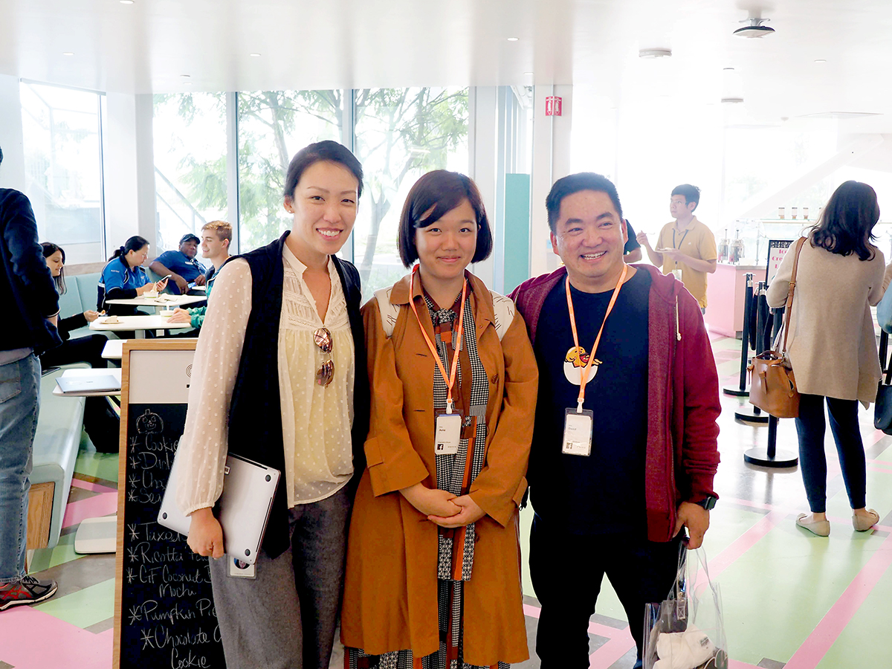
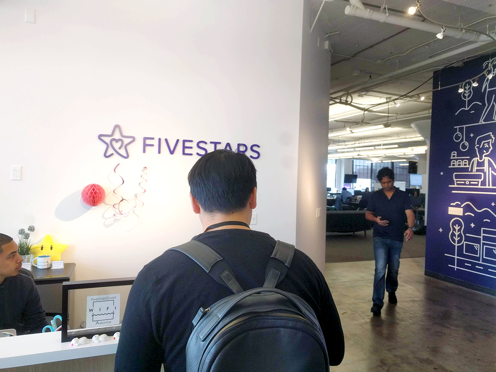

제품을 담당하는 팀이 일하는 방식은 제품 그 자체에 영향을 줍니다. 어떠한 기능을 어떤 주기로 사용자에 배포할 것이냐에 대한 결정을 하는 과정이기 때문에 구체적인 결과물에 영향을 끼치기도 하지만 누가 기능을 만들고 디버깅 하고 그 업무에 대한 조직의 시각에 따라 결과적으로는 제품의 품질에도 영향을 미칩니다.

구태의연한 말이지만 테크 업계에서 일하는 방식에 있어 정답은 없습니다. 제품과 조직은 끊임없이 변화하고 이에 맞추어 일하는 방식도 바뀌어야 하기 때문에 지난 해에 불합리하다고 여기던 방식이 올해는 검토해 볼 만한 것이 될 수도 있습니다. 일하는 방식 그 자체도 협의를 거쳐 지속적으로 개선하는 과정이 필요합니다.

일하는 방식과 함께 제품 그리고 조직마다 프로덕트 매니저의 역할과 권한도 바뀝니다. 비즈니스에 제품이 기여하는 정도에서부터 조직 내 이해관계자와의 관계까지 제품과 조직의 모든 요소가 프로덕트 매니저의 일하는 방식을 바꿉니다. 스포카 프로덕트 매니저의 경우, 서비스 백로그 관리의 역할도 담당하기 때문에 유동적인 일하는 방식에 따른 결과는 제품에 다시금 반영됩니다.

이번 샌프란시스코 테크 업계 인터뷰는 위와 같은 가정 하에 ‘스포카는 앞으로 어떤 방식으로 일할 것인가'라는 질문에 대한 참고할 사례를 수집하기 위하여 진행하였습니다. 닭과 계란 문제일 수 있지만 이것은 ‘스포카는 어떤 제품을 만들고자 하는가'하는 고민과 맞닿아 있습니다.

인터뷰는 총 5회에 걸쳐 아래와 PM 분들과 진행 되었습니다. 흔쾌히 인터뷰에 응해 주신 모든 분들께 감사드립니다. 각 인터뷰이와 나눈 이야기 중 인상적이었던 부분을 발췌하여 2개의 포스팅에 걸쳐 공유하겠습니다.

- Stephanie Shum(Director Product Management at Facebook)
- David Park (Refereum COO)
- Michael Hsu (Product Manager at FiveStars)
- Chris Nguyen (VP Product at Bleacher Report)
- 홍성철 (Product Manager at Udemy)
- 정대영 (Product Manager at Intuit)

---

### Stephanie Shum(Director Product Management at Facebook) & David Park (Refereum COO)

<figure>
  
  <figcaption>
    좌측에서부터 Stephanie Shum, 옥지혜, David Park
  </figcaption>
</figure>

**제품팀에 대한 동기부여는 PM의 중요한 역할 중 하나입니다. 팀에의 동기부여를 어떻게 하나요?**

S: 모든 제품팀의 구성원은 실제 사용자가 사용하는 제품을 만들고 그것이 비즈니스 임팩트가 있을 때 신나게 일할 수 있다. 그리고 제품이 전달하는 가치가 유의미하고 수익을 창출할 때 즐거워한다. 실제 사용자를 만날 수 있는 기회를 제공하고 팀에서 작업한 내용의 비즈니스 임팩트를 지속적으로 공유해야 한다.

D: 엔지니어로 일할 당시에 중요하다고 생각하지 않는 것을 만들고 심지어 배포도 하지 못했을 때 가장 의욕이 떨어졌다. 진행 중인 작업의 사업적인 의미를 알리거나 테스트를 진행하는 이유를 팀에 설명할 수 있어야 한다. 사람들은 똑똑하고 쓸모 없는 것을 만드는 일을 싫어한다. 엔지니어를 이해하는 것은 매우 중요하다. 모든 엔지니어와의 원온원 면담을 진행하여 팀의 상태를 알고 그들이 행복할 수 있도록 노력해야 한다.

S: 사람을 움직이는 것이 무엇인지 알아야 한다. 어떤 사람은 제품에 대한 스토리텔링에 흥미를 가지기도 하고 데이터 기반의 설득이 효과적인 사람도 있고 신기술에 관심을 보이는 사람도 있다. 나는 각자의 자기효능감을 느낄 수 있도록 실제 사용자와 대면하는 경험을 주는 것이 중요하다고 생각한다.

**제품팀이 잘 하고 있는지에 대하여 어떠한 잣대로 평가하나요?**

S: 제품팀이 행복하고 제품이 목표를 달성하고 있다면 잘 하고 있는 것이다. 페이스북은 서로에 대한 피드백에 대하여 열린 편이라 의견 교환이 빠르게 자주 이루어진다. 제품팀의 직무 만족도에 있어 업무 외적인 부분도 PM이 관장하는 영역이다. 이를테면 모종의 이유로 팀의 분위기가 침체 되었을 때 팀 전체 티타임을 가지면서 휴식할 수 있도록 유도하는 것도 PM의 역할이다. 어찌 보면 PM의 역할은 파티 플래너와 같다.

D: 제품팀의 모든 평가는 제품의 비즈니스 임팩트에 달려있다. 유능한 피엠은 적절한 시점에 제품에 필요한 기능을 배포하는 데에 있다.

**제품의 목표를 달성하지 못했을 때의 경험을 공유 해주세요.**

S: 목표 달성을 하지 못함으로 인해서 무엇을 얻었는지가 명확하다면 그것은 실패가 아니다. 이를테면 페이스북의 경우, 매해 안정적으로 셧다운 했거나 유의미한 실패를 한 팀의 PM에게 상을 준다. 특정 팀은 수립된 전략에 따라 제품을 만들었다. 결과적으로는 목표를 달성하지 못했는데 개발 과정에는 문제가 없었으나 수립된 전략의 재검토가 필요하다는 결론이 났다. 그 팀의 PM이 그 해의 수상자였다.

**기술 조직이 아닌 팀과의 커뮤니케이션은 쉽지 않습니다. 영업 조직과의 커뮤니케이션에 있어 팁이 있나요?**

S: 제품팀의 인원이 주기적으로 현장에서 실제 사용자와 주변환경을 마주할 수 있도록 하자. 영업 조직에게 제품팀이 영업환경에 대하여 진지하게 생각한다는 것을 보여줄 필요가 있다. 반대로 영업과 사업개발 조직은 사용자 피드백의 필터가 되어야 한다. 이들은 수많은 의견을 청취하지만 모든 내용을 제품팀에 전달하지 않아야 한다. 비즈니스상 필요하다고 생각하는 몇 가지를 추려 제품팀에 전달하고 제품팀은 이를 실행할 수 있는 계획을 세우는 일을 담당한다. 서로의 일에 대한 존중과 공감 그리고 제품과 사용자와의 밀접한 관계를 언제나 염두에 주는 것이 중요하다.

D: 인정 역시 중요하다. 제품팀의 인원을 포함하여 기술 조직이 아닌 팀과의 협업이 있는 프로젝트가 런칭한 경우, 모두가 볼 수 있는 메일 등을 통해 감사를 전하는 것도 팁이다.

---

### Michael Hsu (Product Manager at FiveStars)

<figure>
  
  <figcaption>
    Fivestars 인터뷰 진행을 위해 게스트 체크인 중
  </figcaption>
</figure>

**스스로가 유능한 PM이라는 것을 어떤 잣대로 평가 하나요?**

M: PM의 역할과 권한은 제품마다 그리고 조직마다 모두 다르다. 과거의 경험을 미루어 볼 때, 회사의 규모를 불문하고 PM은 그 자신이 제품의 성공을 책임 지는 사람이다. 따라서 구체적으로 무슨 일을 하는지 보다는 제품이 성공하기 위해서라면 다양한 일을 해야 한다. 

나는 3가지를 중점적으로 생각한다 - “제품(팀)이 사업목표에 기여하고 있는가”, “제품(팀)이 각 고객에게 유의미한 가치를 전달하고 있는가”, “각 팀(원)이 자신이 이루고자 하는 바를 달성하고 있는가”. 자원이 한정적이라는 것을 언제나 잊어서는 안된다. 최대의 비즈니스 임팩트를 낼 수 있는 선택을 해야 하고 이를 하기 위해 업무에 우선순위를 부여함에 있어 단호 해야 한다.

**현재 담당하고 있는 팀의 구성은 어떻게 되어 있나요?**

M: 제품팀만 두고 보았을 때, 전체 인원 중 10%가 운영만을 전담하는 팀이다. 영업인원 대비 비율은 1:7 정도에 해당한다. 이외의 팀은 각자 새로운 기능을 만드는 업무를 담당한다. (서비스 특성 상 버그가 많을 수 밖에 없는데, 운영 팀의 동기부여는 어떻게 하는지?) 우리 조직의 경우 신규 기능 개발 보다 기존 서비스 유지보수에 엔지니어들이 관심이 많다. 실제 사용자가 사용하는 것을 보고 왔을 때는 더욱 그러한 편이다.

**조직 내 PM이 모자라는 상황일 때 어떤 방식으로 일할 수 있을까요?**

M: 권한을 위임한다. 유저 스토리 작성, 기능 요구사항 구체화 하는 일 등 가시화 되지 않는 일지만 반드시 진행해야 하는 일을 팀원에게 위임하는 방법이 있다. 이 때 각 기능의 개발을 위한 비용과 시간 계산 등에 대한 책임도 함께 질 수 있도록 하는 것이 좋다.

**기능에 대한 요구사항은 어떻게 수렴하나요?**

M: 각 팀 단위로 스프린트에서 진행할 티켓을 정하고 백로그 관리를 담당하게 된다. 이 절차는 기술적인 요구사항이 한정적인 자원 안에서 처리 된다는 점과 비즈니스 임팩트의 여하에 따라 우선순위를 정하는 협상의 과정이라는 것을 가시화 한다는 점에서 유효하다. 요구사항을 발의 하는 사람은 어떠한 배경에서 해당 기능을 제안을 하고 그것이 가져올 비즈니스 임팩트에 대한 내용을 포함하여 발의할 수 있어야 한다.

우선순위를 결정함에 가장 중요한 잣대는 비즈니스 임팩트를 얼마나 발생시킬 수 있느냐이다. 운영팀이 대응할 버그를 결정함에 있어서도 데이터를 기반으로 한다. 신규 기능에 대한 요구사항은 이 회의체에 접근하기 이전에 필터링 되어 발의되며 마찬가지로 기존 업무와의 우선순위를 조정하여 스프린트 항목을 정한다.

---

Chris Nguyen, 홍성철님과 정대님의 인터뷰와 인터뷰를 통해 얻은 인사이트는 다음 포스팅에서 다룹니다. 마지막으로 스포카는 [현재 제품을 함께 만들어 나갈 PM을 채용 중](https://spoqa.github.io/jobs/pm.html)입니다. 관심 있으신 분들의 많은 지원 부탁 드립니다.

